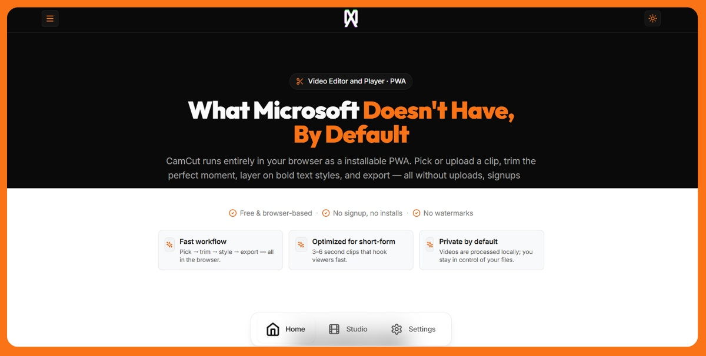

# CamCut - Browser-Based Video Editor & Player

A free, browser-based Progressive Web App (PWA) for creating viral short-form video clips with text overlays. No signup, no watermarks, no uploads to servers—everything runs locally in your browser.


 
 

## Screenshot 


## 🎬 Features

### Video Editing
- **Upload or Select**: Choose from a library of trending clips or upload your own video
- **Precise Trimming**: Frame-accurate video trimming with timeline controls
- **Text Overlays**: Six short-form-ready text styles (Comic, Neon, Retro, Bold, Elegant, Outline)
- **Real-time Preview**: See your edits instantly in the browser
- **Local Export**: Download your finished clips without watermarks

### Video Player
- **Full-Featured Player**: Play, pause, seek, volume control, and fullscreen
- **Keyboard Shortcuts**: Space/K to play/pause, arrow keys to seek, M to mute, F for fullscreen
- **Offline Support**: Play videos stored locally even when offline
- **File Handling**: Open video files directly from your system (Windows File Handling API)

### Progressive Web App (PWA)
- **Installable**: Install as a native app on desktop and mobile
- **Offline Capable**: Works offline with cached resources and IndexedDB storage
- **Fast Loading**: Optimized caching strategies for quick access
- **App Shortcuts**: Quick access to Studio and Gallery from installed app

### Privacy & Security
- **100% Local Processing**: All video processing happens in your browser
- **No Server Uploads**: Your videos never leave your device
- **No Signup Required**: Start creating immediately
- **No Tracking**: Privacy-first approach

## 🚀 Getting Started

### Prerequisites

- **Node.js** 18+ and **pnpm** (or npm/yarn)
- Modern browser with support for:
  - Web APIs (File API, IndexedDB, Service Workers)
  - Video codecs (MP4, WebM, etc.)

### Installation

1. Clone the repository:
```bash
git clone https://github.com/alihd-tech/CamCut.git
cd CamCut
```

2. Install dependencies:
```bash
pnpm install
```

3. Start the development server:
```bash
pnpm dev
```

4. Open your browser and navigate to `http://localhost:5173`

### Building for Production

```bash
pnpm build
```

The production build will be in the `dist` directory, ready to be deployed to any static hosting service.

### Preview Production Build

```bash
pnpm preview
```

## 📁 Project Structure

```
CanCut/
├── src/
│   ├── components/          # React components
│   │   ├── VideoPlayer.tsx  # Full-featured video player
│   │   ├── Studio.tsx       # Main video editor
│   │   ├── VideoTrimmer.tsx # Video trimming interface
│   │   ├── TextEditor.tsx   # Text overlay editor
│   │   ├── VideoPreview.tsx # Preview and export
│   │   ├── Gallery.tsx      # Video gallery
│   │   ├── LocalVideos.tsx  # Local video storage viewer
│   │   └── ...
│   ├── contexts/            # React contexts
│   │   └── SettingsContext.tsx
│   ├── hooks/               # Custom React hooks
│   │   ├── useOfflineStatus.ts
│   │   └── useVideoEditor.ts
│   ├── lib/                 # Utility libraries
│   │   └── api.ts
│   ├── router.tsx           # Client-side routing
│   ├── types/               # TypeScript type definitions
│   │   └── video.ts
│   ├── utils/               # Utility functions
│   │   └── videoStorage.ts  # IndexedDB video storage
│   ├── App.tsx              # Main app component
│   └── main.tsx             # Entry point
├── public/                  # Static assets
│   ├── videos/             # Sample video clips
│   ├── manifest.json        # PWA manifest
│   └── sw.js               # Service worker
├── dist/                    # Production build output
├── vite.config.ts           # Vite configuration
├── tailwind.config.js       # Tailwind CSS configuration
└── package.json
```

## 🛠️ Technology Stack

- **Framework**: React 18.3.1 with TypeScript
- **Build Tool**: Vite 5.4.2
- **Styling**: Tailwind CSS 3.4.1
- **Icons**: Lucide React
- **Animations**: Framer Motion
- **File Upload**: React Dropzone
- **PWA**: Vite Plugin PWA with Workbox
- **Routing**: Custom hash-based router

## 📱 PWA Features

### Installation
- **Desktop**: Look for the install prompt in your browser's address bar
- **Mobile**: Use "Add to Home Screen" from the browser menu
- **Windows**: Can be installed from Microsoft Edge

### Offline Functionality
- Videos uploaded are stored in IndexedDB for offline access
- App shell and static assets are cached
- Service worker handles caching strategies:
  - Videos: CacheFirst (30 days)
  - API: NetworkFirst (5 minutes)
  - Static assets: StaleWhileRevalidate
  - HTML: NetworkFirst (1 day)

### File Handling (Windows)
- Supports opening video files directly from File Explorer
- Registered file types: MP4, MKV, WebM, MOV, AVI, M4V, 3GP, FLV, WMV, OGV, MPEG, MPG

## 🎨 Video Editor Workflow

1. **Select Source**: Choose from library or upload your own video
2. **Trim**: Set in/out points on the timeline (3-6 seconds for short-form)
3. **Add Text**: Type your caption and choose a style
4. **Preview & Export**: Review your clip and download

## 🎮 Video Player Controls

### Mouse/Touch
- Click video to play/pause
- Double-click for fullscreen
- Use control bar for seek, volume, and playback speed

### Keyboard Shortcuts
- `Space` or `K`: Play/pause
- `←` / `→`: Seek backward/forward 5 seconds
- `M`: Mute/unmute
- `F`: Toggle fullscreen
- `0-9`: Seek to percentage (0% to 90%)

## ⚙️ Configuration

### Settings
- **Duration Preference**: Choose between short-form (3-6s) or long-form (30+s)
- **Theme**: Light/dark mode support
- **Storage Management**: View and manage stored videos

### Environment Variables
The app uses Vite's environment variables. See `vite.config.ts` for configuration.

## 🧪 Development

### Available Scripts

- `pnpm dev` - Start development server
- `pnpm build` - Build for production
- `pnpm preview` - Preview production build
- `pnpm lint` - Run ESLint
- `pnpm typecheck` - Run TypeScript type checking

### Code Style
- ESLint for code linting
- TypeScript for type safety
- Prettier (if configured) for code formatting

## 🌐 Browser Support

- **Chrome/Edge**: Full support (recommended)
- **Firefox**: Full support
- **Safari**: Limited PWA support (iOS 11.3+)
- **Opera**: Full support

## 📦 Deployment

### Static Hosting
The app can be deployed to any static hosting service:
- **Vercel**: Connect your repository
- **Netlify**: Drag and drop the `dist` folder
- **GitHub Pages**: Use GitHub Actions
- **Cloudflare Pages**: Connect repository
- **AWS S3 + CloudFront**: Upload `dist` folder

### Requirements
- HTTPS required for PWA features (Service Workers)
- Proper MIME types for video files
- CORS headers if using external APIs

## 🔒 Privacy & Security

- All video processing happens client-side
- No data is sent to external servers (except API calls if configured)
- Videos stored in IndexedDB remain on your device
- No analytics or tracking by default

## 🤝 Contributing

Contributions are welcome! Please feel free to submit a Pull Request.
 
## Live Demo

- Preview : [Camcut.fun](https://camcut.fun)
 
